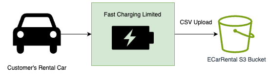
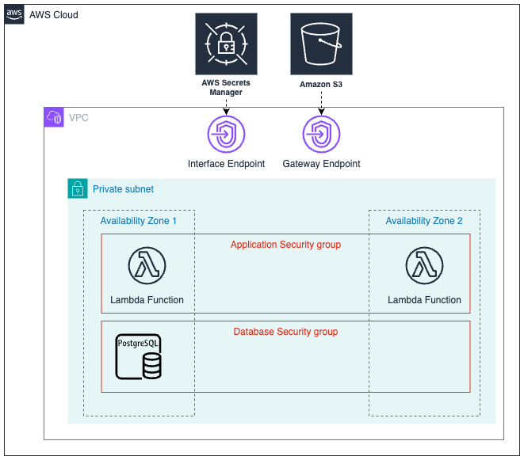

# S3 Processing with Java and AWS Lambda

## Introduction

In this project I will show you how to process files with Java which have been uploaded to S3. I use
the example of an electric car rental business, lets call it ECarRentals. ECarRentals has made agreements with different
charging providers. When an ECarRental car is charged at one of their points, they will upload a CSV file to an S3 
bucket with details of the car, and how much the car was charged. ECarRentals will process this data and pay each 
provider at the end of the month.

## Solution

To solve this problem you will learn how to make an AWS Lambda function to listen to S3 Object Created events. Download
the files from S3, process them and save them to Postgres. Although the description sounds trivial there is a lot of 
detail to understand. 

### Architecture Diagram

Because this is an example I want people to experimental with I've designed the solution to make use of the AWS 
free-tier, and not use resources that are expensive to personal users and students. For example there are no NAT 
Gateways in this solution, and the RDS instance is available on the free tier.

We are using private subnets for our Lambda functions and database instance. There is no reason to make our database
accessible from a public ip address. So that our Lambda function can access the private database we have attached our
Lambda function to the VPC and are using security groups to further increase security.

To access S3 from a private subnet you will need a VPC Endpoint. If you don't have this your API calls to S3 will 
time out as there is no route to the public internet.

### Trade-offs

- Single RDS Postgres instance

## Deployment

### Requirements

- AWS Account
- Java 21
- Maven
- AWS CDK

